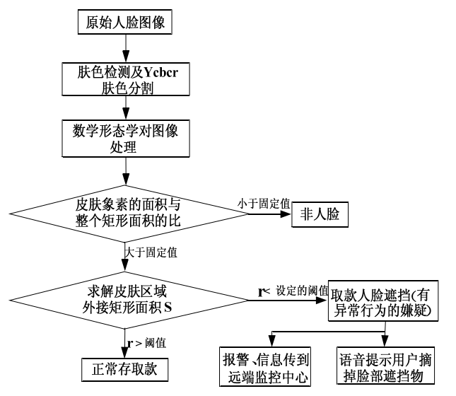

一般需求四个环节：
* 目标检测  特征提取  行为识别  异常判断  

图像预处理： 有噪声  

颜色空间转换   图像滤波     形态学算子 

目标提取 ：

侦差法    光流法    混合多高斯背景建模算法  ViBe算法

ATM内背景不随时间变化，主要因素是光照： 背景差分法

ATM: 嵌入式系统

深度学习

2D-CNN 行为识别  
 
3D卷积神经网络： 视频人行为变化具有连续性      

目标检测 目标跟踪  目标分类  目标行为识别

视频运动目提取：  
    侦差法    光流法    混合多高斯背景建模算法  ViBe算法

视频运动目标跟踪
    基于区域   基于特征   基于模型  基于活动轮廓  
     
    算法实时性  ATM单个人体出现遮挡可能性较小   改进Hu特征提取  采用Mean-shift 跟踪算法  

异常行为识别
    隐马尔科夫模型 
     
    人脸： 蒙面 遮挡           
           预先定义异常行为语义                
           获取： 全局监控摄像头

    整体： 手拿异物 跑 下蹲   
           训练测试各个样本  判断异常行为       
           获取： ATM机正对人脸的摄像头

## 目标检测

### 人脸对象： 
   颜色空间：       目的：  获取颜色信息    
                   方法：  RGB（三种分量混杂一起 不利于肤色分割）   
                          HSV (表达形式复杂,实时性)
                          YCbCr（肤色聚类性比较好）

   二值图像处理:    目的： 去噪              
                   方法：  数学形态学              

   人脸检测肤色模型选择： 基于椭圆肤色模型： 实时性好点     
                         基于高斯模型 ： 计算量大 实时性差
                    

   人脸检测的方法： 基于先验知识的肤色检测方法  基于模板的方法   基于统计的学习方法
   肤色提取的优点： 速度快 姿态不变性

  
### 人体对象
     光流法： 主要采用了运动目标随时间变化的光流特性
              缺点： 受噪声 多光源 遮挡影响  计算复杂  抗燥性差

     侦差法：  
              计算简单 实时性比较好  对背景光照变化不敏感 适应性强

     背景差分法： 主流方法
              实现简单 实时性好   相对于侦差法能够得到较完整的目标特征 适用于摄像机静止的情况 
              缺点： 随着时间推移  会出现许多伪目标点
          
     
     自适应高斯背景模型  
              利用静止摄像机采集的背景图像 会随着时间推移发生变化 
              因此 采用背景差分 需要建立背景模型 不断更新背景图像   适应这种背景变化

        
            

## 目标跟踪

### 特征选择与提取
   Hu矩特征： 在提取人体行为特征时具有很好的平移 缩放 旋转不变性和抗干扰性
   改进Hu矩： 中心距越大 越反应的细节越多   对噪声就会越敏感

### 目标跟踪方法
   粒子滤波跟踪： 计算过程复杂  实时性差 
   Mean-shift：  实时性好 对遮挡 目标变形鲁棒性好

## 异常行为识别
   行为识别方法： 
       基于模板匹配的静态识别方法：  
                       计算简单  但缺乏动态特性  对于噪声和运动时间间隔变化敏感

       基于概率统计的动态识别法： 隐马尔可夫模型HMM   支持向量机SVM   动态贝叶斯网络 神经网络等

   

  

  

     
    

  

     

