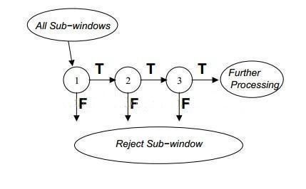

# 概述

如何理解一张图片？根据后续任务的需要，有三个主要的层次。
* 一是分类（Classification）
* 二是检测（Detection ）
* 三是分割（Segmentation）：分割包括语义分割（semantic segmentation）和实例分割（instance segmentation），

##  [传统方法](https://www.zhihu.com/question/53438706)

传统算法最经典的莫过于Harr+adaboost 的检测算法和hog+Svm以及DPM算法了

### Haar+Adaboost 

其他级联分类器框架如：**Haar/LBP/积分HOG/ACF feature+Adaboost**

其实这就是boosting由简单弱分类拼装强分类器的过程，这个算法第一次使目标检测成为现实
  

  

OpenCV有对级联分类器的经典实现

### HoG+SVM

之后又有人魔改出LoG/DoG/RoG等一系列特征，没啥意思就不多说了。

值得一提的是，有人把SVM中的HoG改为Integral HoG 用于级联分类器。这也就是目前OpenCV级联分类器的积分HOG的原型：

##  [深度学习](https://zhuanlan.zhihu.com/p/34142321) 
 
### 两阶段（2-stage）检测模型: 准

**`基于region proposal(two stage)：R-CNN家族，包括Faster R-CNN/Mask R-CNN/RFCN`**

* 顾名思义，两刀解决问题：
   * 1、生成可能区域（Region Proposal） & CNN 提取特征
   * 2、放入分类器分类并修正位置

* 这一流派的算法都离不开 Region Proposal ，即是优点也是缺点，主要代表人物就是 R-CNN 系。

####  R-CNN: R-CNN系列
从图像分类任务的经验来看，CNN网络自动习得的特征取得的效果已经超出了手工设计(如SIFT, HOG)的特征。 

CNN的想法直接明了，即将检测任务转化为区域上的分类任务

模型本身存在的问题也很多，如需要训练三个不同的模型（proposal, classification, regression）、重复计算过多导致的性能问题等。

####  Fast R-CNN: 共享卷积运算 

R-CNN耗时的原因是CNN是在每一个Proposal上单独进行的，没有共享计算，便提出将基础网络在图片整体上运行完毕后，再传入R-CNN子网络，共享了大部分计算，故有Fast之名

#### Faster R-CNN: 两阶段模型的深度化 

本文的主要贡献是提出Regional Proposal Networks，替代之前的SS算法。RPN网络将Proposal这一任务建模为二分类（是否为物体）的问题。

### 单阶段（1-stage）检测模型: 快

**`基于回归(one-shot)：YOLO/YOLO2/SSD/DSSD`**

* 一刀流回归的思想  
   - 一刀流最核心的还是利用了分类器优秀的分类效果，首先给出一个大致的范围（最开始就是全图）进行分类，然后不断迭代这个范围直到一个精细的位置，如上图从蓝色的框框到红色的框框
* 这样做的优点就是快，但是会有许多漏检

#### YOLO

它将检测任务表述成一个统一的、端到端的回归问题，并且以只处理一次图片同时得到位置和分类而得名。 

* 主要优点： 
  - 快 实时
  - 全局处理使得背景错误相对少，相比基于局部（区域）的方法， 如Fast RCNN。
  - 泛化性能好，在艺术作品上做检测时，YOLO表现比Fast R-CNN好。

* 存在一些问题
  - 划分网格较为粗糙 限制了对小尺度物体和相近物体的检测。 

#### SSD: Single Shot Multibox Detector 

* SSD相比YOLO有以下突出的特点
  - 多尺度的feature map：这一点试图提升小物体的检测精度。
  - 更多的anchor box，

轮子： [常用的检测算法](https://github.com/tensorflow/models/tree/master/research/object_detection)

