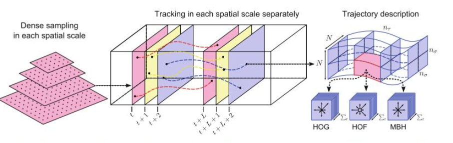

#  行为分类

## 任务概述

### 任务特点
行为识别和图像分类其实很相似，图像分类是按照图像中的目标进行软分类，行为识别也类似。
最开始的时候类似于UCF数据集，都是采用的单标签，也就是一段视频只对应一个标签。
现在CPVR举办的Activitynet(Kinetics 数据集)每段视频中包含多个标签。相比于图像分类，
`视频多了一个时序维度，而这个问题恰恰是目前计算机领域令人头疼的问题。`

### 研究难点

* 行为识别处理的是视频，所以相对于图像分类来说多了一个需要处理的时序维度 
* 行为识别还有一个痛点是视频段长度不一，而且开放环境下视频中存在多尺度、多目标、摄像机移动等众多的问题。

## 传统方法

在深度学习出现之前，表现最好的算法是iDT   
* IDT的思路是利用光流场来获得视频序列中的一些轨迹，再沿着轨迹提取HOF，HOG，MBH，trajectory4中特征，
* 其中HOF基于灰度图计算，另外几个均基于dense optical flow(密集光流计算)。
* 最后利用FV(Fisher Vector)方法对特征进行编码，再基于编码训练结果训练SVM分类器

iDT算法框架主要包含：密集采样特征点，特征轨迹跟踪和基于轨迹的特征提取三个部分。

  

## TWO STREAM方法

Two-Stream CNN网络顾名思义分为两个部分，一部分处理RGB图像，一部分处理光流图像。最终联合训练，并分类。

光流栈(Optical flow Stacking):
*  简单的来说就是计算每两帧之间的光流，然后简单的stacking。

缺点：
* two-stream的方法很大的一个弊端就是不能对长时间的视频进行建模

TSN网络提出了一个很有用的方法，先将视频分成K个部分，然后从每个部分中随机的选出一个短的片段，然后对这个片段应用上述的two-stream方法，最后对于多个片段上提取到的特征做一个融合
  
## C3D方法

目前来看C3D的方法得到的效果普遍比Two-Stream方法低好几个百分点。但是C3D任然是目前研究的热点，主要原因是该方法比Two-Stream方法快很多，而且基本上都是端到端的训练，网络结构更加简洁。

C3D的意思是：用三维的卷积核处理视频。

## RNN方法

视频除了空间维度外，最大的痛点是时间序列问题。  RNN网络非常适合处理序列。

RPAN网络框架可以分为三个大的部分。 （RPAN中引入了姿态监督的机制）
* 特征生成部分：用Two-Stream的方法生成
* 姿态注意机制
* LSTM时序处理网络

# 行为检测

相比于行为分类，行为检测难度更高，不仅需要定位视频中可能存在行为动作的视频段，还需要将其分类。

## 研究难点

* 时序信息。与行为识别/分类一样，视频理解的通用难点就是时序信息的处理。所以针对这一点目前的主要方法基本上都是使用RNN读入CNN提取的特征，或者直接使用C3D一样的时序卷积。
* 边界不明确。不同于行为识别的是，行为检测要求做精确的动作区间检测，而生活中一个动作的产生往往边界不是十分确定的，所以这也是导致目前行为检测mAP偏低的原因。
* 时间跨度大。在生活中，一个行为动作往往跨度非常大，短的动作几秒左右，比如挥手。长的动作有的持续数十分钟，比如攀岩、骑行等等。这使得我们在提取Proposal的时候变得异常的艰难。

## CDC网络

CDC网络[13]是在C3D网络基础上，借鉴了FCN的思想。在C3D网络的后面增加了时间维度的上采样操作，做到了帧预测(frame level labeling)。

##  R-C3D网络

基于Faster R-CNN和C3D网络思想。对于任意的输入视频L，先进行Proposal，然后用3D-pooling，最后进行分类和回归操作。

