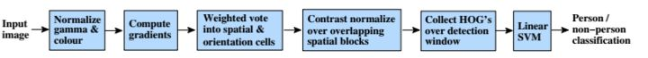

行人检测要解决的主要难题是:
* 外观差异大。包括视角，姿态，服饰和附着物，光照，成像距离等。从不同的角度看过去，行人的外观是很不一样的。处于不同姿态的行人，外观差异也很大。由于人穿的衣服不同，以及打伞、戴帽子、戴围巾、提行李等附着物的影响，外观差异也非常大。光照的差异也导致了一些困难。远距离的人体和近距离的人体，在外观上差别也非常大。
* 遮挡问题。在很多应用场景中，行人非常密集，存在严重的遮挡，我们只能看到人体的一部分，这对检测算法带来了严重的挑战。
* 背景复杂。无论是室内还是室外，行人检测一般面临的背景都非常复杂，有些物体的外观和形状、颜色、纹理很像人体，导致算法无法准确的区分。
* 检测速度。行人检测一般采用了复杂的模型，运算量相当大，要达到实时非常困难，一般需要大量的优化。

## 基于运动检测的算法

如果摄像机静止不动，则可以利用背景建模算法提取出运动的前景目标，然后利用分类器对运动目标进行分类，判断是否包含行人。常用的背景建模算法有：  

* 高斯混合模型，Mixture of Gaussian model[1]
* ViBe算法[2]
* 帧差分算法
* SACON，样本一致性建模算法[3]
* PBAS算法[4] 

这些背景建模算法的思路是通过前面的帧学习得到一个背景模型，然后用当前帧与背景帧进行比较，得到运动的目标，即图像中变化的区域

背景建模算法实现简单，速度快，但存在下列问题：

* 只能检测运动的目标，对于静止的目标无法处理
* 受光照变化、阴影的影响很大
* 如果目标的颜色和背景很接近，会造成漏检和断裂
* 容易受到恶劣天气如雨雪，以及树叶晃动等干扰物的影响
* 如果多个目标粘连，重叠，则无法处理

## 基于机器学习的方法

**介绍人工特征+分类器的方案** 

人体有自身的外观特征，我们可以手工设计出特征，然后用这种特征来训练分类器用于区分行人和背景。这些特征包括颜色，边缘，纹理等机器学习中常用的特征  

采用的分类器有神经网络，SVM，AdaBoost，随机森林等计算机视觉领域常用的算法。由于是检测问题，因此一般采用滑动窗口的技术  

### HOG+SVM

梯度方向直方图(HOG)是一种`边缘特征`，它利用了边缘的朝向和强度信息，后来被广泛应用于车辆检测，车牌检测等视觉目标检测问题。  

*HOG的做法是固定大小的图像先计算梯度，然后进行网格划分，计算每个点处的梯度朝向和强度，然后形成网格内的所有像素的梯度方向分分布直方图，最后汇总起来，形成整个直方图特征*  

  

得到候选区域的HOG特征后，需要利用分类器对该区域进行分类，确定是行人还是背景区域 

在实现时，使用了线性支持向量机，这是因为采用非线性核的支持向量机在预测时的计算量太大，与支持向量的个数成正比(SVM)

目前OpenCV中的行人检测算法支持HOG+SVM以及HOG+Cascade两种，二者都采用了滑动窗口技术，用固定大小的窗口扫描整个图像，然后对每一个窗口进行前景和背景的二分类。为了检测不同大小的行人，还需要对图像进行缩放。  

### HOG+AdaBoost
由于HOG + SVM的方案计算量太大，为了提高速度，后面有研究者参考了VJ[6]在人脸检测中的分类器设计思路 将AdaBoost分类器级联的策略应用到了人体检测中，只是将Haar特征替换成HOG特征，因为Haar特征过于简单，无法描述人体这种复杂形状的目标。

  

相同条件下的预测时间只有基于SVM方法的十分之一。 

### ICF+AdaBoost

HOG特征只关注了物体的边缘和形状信息，对目标的表观信息并没有有效记录，所以很难处理遮挡问题，而且由于梯度的性质，该特征对噪点敏感。   

针对这些问题后面有人提出了积分通道特征（ICF）[7]，积分通道特征包括10个通道： 

* 6 个方向的梯度直方图，3 个LUV 颜色通道和1 梯度幅值， 

为了检测不同大小的行人，作者并没有进行图像缩放然后用固定大小的分类器扫描，而是训练了几个典型尺度大小的分类器，对于其他尺度大小的行人，采用这些典型尺度分类器的预测结果进行插值来逼近，这样就不用对图像进行缩放。

### DPM+ latent SVM

行人检测中的一大难题是遮挡问题，为了解决这一问题，出现了采用部件检测的方法，把人体分为头肩，躯干，四肢等部分，对这些部分分别进行检测，然后将结果组合起来，使用的典型特征依然是HOG，采用的分类器有SVM和AdaBoost。  

DPM（Deformable Parts Models）是一种基于组件的检测算法,DPM检测中使用的特征是HOG，针对目标物不同部位的组建进行独立建模。  

DPM中根模型和部分模型的作用，  
* 根模型（Root-Filter）主要是对物体潜在区域进行定位，获取可能存在物体的位置，但是是否真的存在我们期望的物体，还需要结合组件模型（Part-Filter）进行计算后进一步确认  

DPM算法在人体检测中取得取得了很好的效果，主要得益于以下几个原因： 
* 基于方向梯度直方图（HOG）的低级特征（具有较强的描述能力）
* 基于可变形组件模型的高效匹配算法
* 采用了鉴别能力很强的latent-SVM分类器  

DPM算法同时存在明显的局限性
* DPM特征计算复杂，计算速度慢
* 人工特征对于旋转、拉伸、视角变化的物体检测效果差 

`这些弊端很大程度上限制了算法的应用场景，这一点也是基于人工特征+分类器的通病。`

采用经典机器学习的算法虽然取得了不错的成绩，但依然存在下面的问题：  
* 对于外观，视角，姿态各异的行人检测精度还是不高
* 提取的特征在特征空间中的分布不够紧凑
* 分类器的性能受训练样本的影响较大
* 离线训练时的负样本无法涵盖所有真实应用场景的情况  

## 基于深度学习的算法

基于深度学习的通用目标检测框架,如Faster-RCNN、SSD、FPN、YOLO等，这些方法都可以直接应用到行人检测的任务中 

* 行人检测主要的方法是 1 使用人工特征+分类器的方案  2  深度学习 

* 使用的分类器 1有线性支持向量机， 2 AdaBoost， 3 随机森林。  

### Cascade CNN  

如果直接用卷积网络进行滑动窗口检测，将面临计算量太大的问题，因此必须采用优化策略   

所以提出了一种用`级联的卷积网络`进行行人检测的方案这借鉴了AdaBoost分类器级联的思想。  

* 前面的卷积网络简单，可以快速排除掉大部分背景区域： 
* 后面的卷积网络更复杂，用于精确的判断一个候选窗口是否为行人

这种做法和人脸检测中的Cascade CNN类似。

### JointDeep 

作者使用了一种混合的策略，以Caltech行人数据库训练一个卷积神经网络的行人分类器。  

该分类器是作用在行人检测的最后的一级，即对最终的候选区域做最后一关的筛选，因为这个过程的效率不足以支撑滑动窗口这样的穷举遍历检测。
 
### SA-FastRCNN 

作者分析了Caltech行人检测数据库中的数据分布，提出了以下两个问题：
* 才行人尺度问题是待解决的一个问题
* 行人检测中有许多的小尺度物体, 与大尺度物体实例在外观特点上非常不同

由于大尺寸和小尺寸行人提取的特征显示出显着差异，作者分别针对大尺寸和小尺寸行人设计了2个子网络分别进行检测。

### Faster R-CNN  

Faster R-CNN中的RPN网络对提取行人候选区域是相当有效的，而下游的检测网络表现的不好。

作者指出了其中的两个原因：
* 对于小目标，卷积层给出的特征图像太小了，无法有效的描述目标；
* 另外，也缺乏难分的负样本挖掘机制。

作者在这里采用了一种混合的策略，用RPN提取出候选区域，然后用随机森林对候选区域进行分类。这一结构如下图所示：

### DeepParts 

提出了一种基于部件的检测方案，称为DeepParts，致力于解决遮挡问题。这种方案将人体划分成多个部位，分别进行检测，然后将结果组合起来。

### RepLoss  

RepLoss[14]由face++提出，主要目标是解决遮挡问题。

### HyperLearner 

提出了一种称为HyperLearner的行人检测算法，改进自Faster R-CNN   

