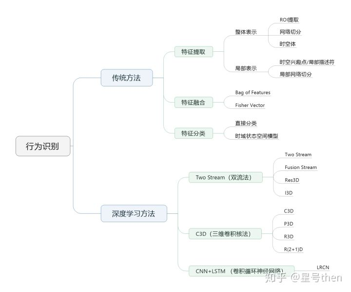
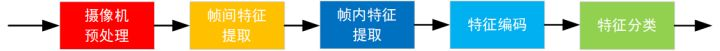
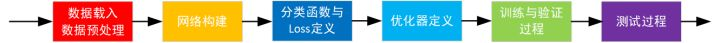

<div align="center">  </div>


# 0-概述

## 行为检测 

```
但在现实应用中更容易遇到的情况是序列尚未在时域分割（Untrimmed），
因此需要同时对行为动作进行时域定位（分割）和类型判定，这类任务一般称为行为检测。
传统 DTW 动态时间规整 分割视频
现在 利用RNN网络对未分割序列进行行为检测（行为动作的起止点的定位 和 行为动作类型的判定）

Action Detection

目的：不仅要知道一个动作在视频中是否发生，还需要知道动作发生在视频的哪段时间

特点：需要处理较长的，未分割的视频。且视频通常有较多干扰，目标动作一般只占视频的一小部分。

分类：根据待检测视频是一整段读入的还是逐次读入的，分为online和offline两种

Offline action detection:
特点：一次读入一整段视频，然后在这一整段视频中定位动作发生的时间

Online action detection:
特点：不断读入新的帧，在读入帧的过程中需要尽可能早的发现动作的发生（在动作尚未结束时就检测到）。
     同时online action detection 还需要满足实时性要求，这点非常重要。
     这导致online action detection不能采用计算复杂度过大的方法（在现有的计算能力下）
     
现有方法：
     逐帧检测法：
              即在视频序列的每帧上独立判断动作的类型，可以用CNN等方法，仅用上了spatial的信息
     滑窗法：  即设置一个固定的滑窗大小，在视频序列上进行滑窗，然后对滑窗得到的视频小片断利用action recognition的方法进行分类。
     
现状：由于此问题难度比action recognition高很多，所以现在还没有效果较好的方法

```
## 行为识别 


### 1.任务特点
```
目的 
  给一个视频片段进行分类，类别通常是各类人的动作

特点
   简化了问题，一般使用的数据库都先将动作分割好了，一个视频片断中包含一段明确的动作，
   时间较短（几秒钟）且有唯一确定的label。
   所以也可以看作是输入为视频，输出为动作标签的多分类问题。
   此外，动作识别数据库中的动作一般都比较明确，周围的干扰也相对较少（不那么real-world）。
   有点像图像分析中的Image Classification任务。

难点/关键点
   强有力的特征：
       即如何在视频中提取出能更好的描述视频判断的特征。
       特征越强，模型的效果通常较好。
   特征的编码（encode）/融合（fusion）：
       这一部分包括两个方面，
       第一个方面是非时序的，在使用多种特征的时候如何编码/融合这些特征以获得更好的效果；
       另外一个方面是时序上的，由于视频很重要的一个特性就是其时序信息，
          一些动作看单帧的图像是无法判断的，只能通过时序上的变化判断，
          所以需要将时序上的特征进行编码或者融合，获得对于视频整体的描述。
   算法速度：
       虽然在发论文刷数据库的时候算法的速度并不是第一位的。
       但高效的算法更有可能应用到实际场景中去.
```

### 2 人体行为识别
```

人体行为识别的目标是从一个未知的视频或者是图像序列中自动分析其中正在进行的行为。

简单的行为识别即动作分类，给定一段视频，只需将其正确分类到已知的几个动作类别，

复杂点的识别是视频中不仅仅只包含一个动作类别，而是有多个，
系统需自动的识别出动作的类别以及动作的起始时刻。
行为识别的最终目标是分析视频中
    哪些人       who
    在什么时刻    when
    什么地方，    where
    干什么事情，  what
即所谓的“W4系统”

人体行为识别应用背景很广泛，主要集中在智能视频监控，
病人监护系统，人机交互，虚拟现实，智能家居，智能安防，
运动员辅助训练，另外基于内容的视频检索和智能图像压缩等
有着广阔的应用前景和潜在的经济价值和社会价值，
其中也用到了不少行为识别的方法。

```


# 1-传统方法

传统方法的具体流程
<div align="center">  </div>


# 2-深度学习方法

深度学习方法具体流程
<div align="center">  </div>

## 2.1 two-stream(双流)方法

[two-stream](https://blog.csdn.net/liuxiao214/article/details/78377791)
```
Two Stream方法最初在这篇文章中被提出：
在空间部分，以单个帧上的外观形式，携带了视频描绘的场景和目标信息。
           其自身静态外表是一个很有用的线索，因为一些动作很明显地与特定的目标有联系。
在时间部分，以多帧上的运动形式，表达了观察者（摄像机）和目标者的运动。

基本原理为:
    1. 对视频序列中每两帧计算密集光流，得到密集光流的序列（即temporal信息）。
    2. 然后对于视频图像（spatial）和密集光流（temporal）分别训练CNN模型，
       两个分支的网络分别对动作的类别进行判断，
    3. 最后直接对两个网络的class score进行fusion（包括直接平均和svm两种方法），得到最终的分类结果。
```


## 2.2 C3D

```
C3D是facebook的一个工作，采用3D卷积和3D Pooling构建了网络。
通过3D卷积，C3D可以直接处理视频（或者说是视频帧的volume）
实验效果：UCF101-85.2% 可以看出其在UCF101上的效果距离two stream方法还有不小差距。
         我认为这主要是网络结构造成的，C3D中的网络结构为自己设计的简单结构，如下图所示。

速度：
        C3D的最大优势在于其速度，在文章中其速度为314fps。而实际上这是基于两年前的显卡了。
用Nvidia 1080显卡可以达到600fps以上。


```


## 2.3 CNN-LSTM
```
人体骨架怎么获得呢？

主要有两个途径：
通过RGB图像进行关节点估计（Pose Estimation openpose工具箱）获得，
或是通过深度摄像机直接获得（例如Kinect）。

每一时刻（帧）骨架对应人体的K个关节点所在的坐标位置信息，一个时间序列由若干帧组成。


思路： 
在视频上先对每一帧做姿态估计（Kinetics 数据集上文章用的是OpenPose），然后可以构建出一个空间上的骨架时序图。
然后应用ST-GCN网络提取高层特征
最后用softmax分类器进行分类


```
