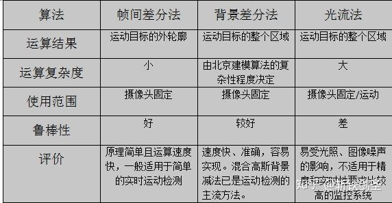
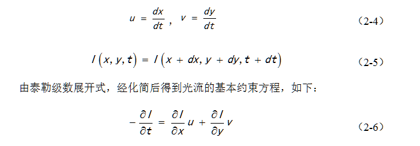

# 概述

## 静态背景下的目标检测

运动目标计算机视觉检测有以下基本方法:帧差法、光流法和背景减法，此外还有特征匹配法、KNN及这些方法的变种（三帧差分、五帧差分）

* 
  

### 1 帧间差分法 
该方法利用图像序列中相邻帧的像素值之间的相关性，先将图像序列中相邻两帧进行相减，然后对得到差值图像进行阈值判断，进而提取动态前景
* 
  

* 优缺点
  - 动态性强,能够适应动态背景下的运动目标检测
  - 但是,这类算法检测出的目标轮廓非常不理想,在目标内部会留有许多空洞,在目标运动较快时目标的轮廓会被扩大,在目标运动较慢时甚至有可能无法得到目标的边界。 

### 2 [背景差分法](https://www.cnblogs.com/xrwang/archive/2010/02/21/ForegroundDetection.html)
获取背景模型的最简单方法是直接捕获一副不包含任何移动物体的“干净”的背景图像。然而，在实际环境中，这样“干净”的背景是很难被捕捉到的

* 
  

* 优缺点
  * 速度快 准确 容易实现
  * 缺点是由于通常需要缓冲若干帧频来学习背景,因此往往需要消耗大量的内存, 

[各种背景差分除的方法](http://code.google.com/p/bgslibrary/)

### 3 光流法
通常，视频序列中背景的光流是一致，与运动目标的光流不同，因此，根据光流的不同就可以提取运动目标和背景区域。

* 
  

* 特点
  * 在摄像机运动、背景变化时,光流法也能检测出运动目标,并且它能同时完成运动目标检测和跟踪
  * 计算复杂度高 很难做到实时检测 非常容易受到噪声干扰

### 4 码本（codebook）
算法为图像中每一个像素点建立一个码本，每个码本可以包括多个码元（对应阈值范围）

* 在学习阶段，对当前像素点进行匹配，
  - 如果该像素值在某个码元的学习阈值内，也就是说与之前出现过的某种历史情况偏离不大，则认为该像素点符合背景特征，需要更新对应点的学习阈值和检测阈值
  - 如果新来的像素值与每个码元都不匹配，则可能是由于动态背景导致，这种情况下，我们需要为其建立一个新的码元。每个像素点通过对应多个码元，来适应复杂的动态背景。

* 在应用时，每隔一段时间选择K帧通过更新算法建立CodeBook背景模型，并且删除超过一段时间未使用的码元。

### 5 混合高斯模型（GMM）

混合高斯建模GMM（Gaussian Mixture Model）作为单核高斯背景建模的扩展，是目前使用最广泛的一种方法。

GMM将背景模型描述为多个分布（能够满足背景的切换，比如树叶晃动），符合其中一个分布模型(有树叶、无树叶)的像素即为背景像素

第一，效果不错,噪声可以很快消除，第二，opencv包含了GMM算法  

GMM针对复杂背景有很好的适应性，其表现也更接近实际应用
* 特点

  * 而能够适应像素层面上的背景扰动问题,并能通过对背景的不断更新,使系统能对背景的变化自适应。
  * 但是,高斯混合模型对于全局光照变化、阴影非常敏感,对于缓慢的运动目标检测效果也不理想。

### 6 ViBe方法

该算法使用概率统计方法对背景建模并采用随机策略来更新背景模型，这和GMM有很大不同（像素的变化存在不确定性很难用一个固定的模型来表征）

* 速度快，效果好，但无法适应光照变化，会出现阴影与空洞。
